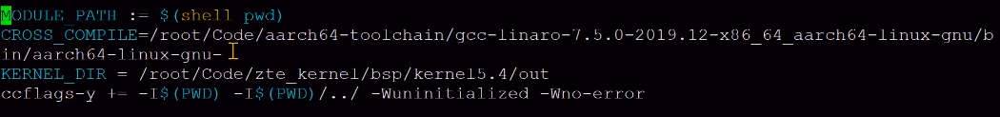
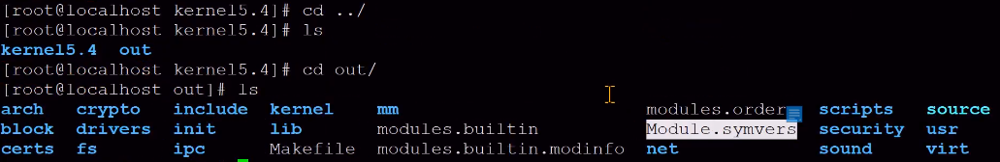
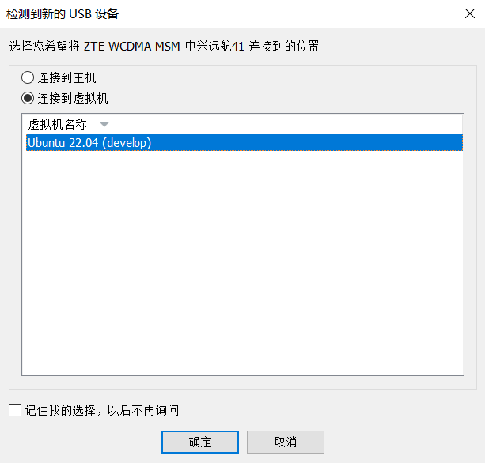
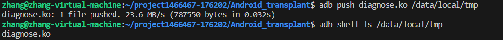
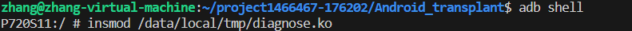
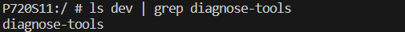

# Android transplant

移植分为两部分：内核模块、用户空间

diagnose-tools/Makefile：

```
deps将编译好的文件放在了lib库里

module是编译内核模块的部分

tools是编译用户空间的部分，需要deps编译好的依赖
```

## 内核模块移植

diagnose-tools/SOURCE/module/Makefile：

```
ifneq ($(findstring aarch64,$(ARCH)),)
	DIAG_EXTRA_CFLAGS += -DDIAG_ARM64		# 编译到安卓手机上时，这里记得加上个ARM64的编译选项，即 DIAG_EXTRA_CFLAGS += -DDIAG_ARM64
endif

	$(MAKE) CFLAGS_MODULE="$(DIAG_EXTRA_CFLAGS)" -C $(KERNEL_BUILD_PATH) M=$(MOD_PATH) modules		# Make的主要部分
	
需要条件编译，指定下载好的编译器（注意：移植到安卓上应该使用clang编译器，这里使用的是gcc）
需要指明要构建目标的内核源码的存放位置（从开源网站下载）
```

<div align='center'></div>

最好把内核源码给编一遍，最后会生成一个符号表：

<div align='center'></div>

注意：开源代码编译出来的符号表可能和手机上的符号表不太一致，所以找中兴那边要了一个，放在：

<div align='center'></div>

这样的话就可以编译出可以和手机上特定环境相匹配的内核模块，但是我们自己编译的内核模块在安卓手机上始终insmod不成功，经查明，安卓的内核对我们的内核模块有白名单限制，为了解决这个问题，我们寻求了中兴的帮助，他们利用他们的环境帮我们重新编译了手机的内核和内核模块，最终内核模块可以成功地在手机上进行insmod操作。具体操作如下所示：

将安卓手机连接至虚拟机：

<div align='center'></div>

在虚拟机终端利用 adb push 命令将已经编译好的 diagnose-tools 内核模块部分 diagnose.ko 复制到安卓系统的 /data/local/tmp 文件夹中：

<div align='center'></div>

在虚拟机终端执行指令 adb shell 进入安卓系统终端界面，然后将 /data/local/tmp 文件夹中的 diagnose.ko 进行插入内核：

<div align='center'></div>

查看是否已经插入成功，执行指令 ls dev | grep diagnose-tools：

<div align='center'></div>

可以看到 dev 目录中已经存在 diagnose-tools，说明已经插入成功

## 用户空间移植

目前用户空间的移植还在开发中，敬请期待 ~

