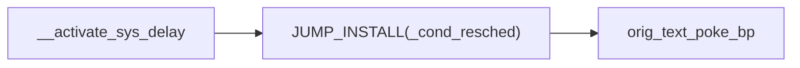

<div align="center"><h1><b>决赛技术报告</b></h1></div>


[TOC]


## 一、项目介绍

选题：proj208-performance-and-diagnosis-tool

项目名称：高负载下性能分析与异常诊断工具

随着现代操作系统的发展，在当前众多的计算机系统中，由于应用负载和系统复杂度的不断提高，系统在高负载情况下可能会出现性能问题和异常情况，而传统的用户态常用的性能工具在高负载情况下常常会失效，表现不佳，无法提供准确的诊断结果，给用户带来不便和风险，这时一个具有高性能、高可靠性 ，同时对系统影响低、准确性强的性能分析和异常诊断工具就显得尤为重要。因此，本项目旨在开发一种高负载情况下的高性能工具，用于分析各类异常情况并对系统进行故障诊断，对于提高系统的性能和稳定性也具有重要意义。

本项目工具实现后应该具有以下特征：

- 高性能：该工具需要在高负载情况下保持较高的性能，能够实时监控系统的各项指标，并能够对各种异常情况进行快速分析和诊断。
- 高可靠性：该工具需要保证在各种复杂的环境下都能够正常工作，而且能够准确地诊断和分析各种异常情况，提供准确的故障诊断报告。
- 对系统影响低：该工具需要在后台运行并对系统的性能影响尽可能小，不会影响到系统的正常运行。
- 准确性强：该工具需要提供准确的诊断结果，不会给用户带来误导和风险，并且支持多种异常情况的诊断。
- 易用性好：该工具需要提供友好的用户界面，简单易用。用户能够通过界面直观地了解系统的运行情况和异常情况，并能够快速地找到解决问题的方法。

本项目的预期目标如下：

- 编写性能工具，采集有关数据，输出火焰图。
- 能够在高负载下进行压力测试，并可靠地完成性能监测和异常分析。
- 在高负载场景下，对工具进程测试，寻找可优化的部分。

## 二、相关资料调研

在高负载下进行性能分析和故障诊断是一项非常复杂和挑战性的任务，需要掌握足够的技术和工具，才能够准确地找到程序中的性能瓶颈，提高系统的运行效率和稳定性。

以下是一些常见的性能分析、异常诊断技术和工具介绍：

1. 内核模块：内核模块（Kernel Module）是一种可以动态加载和卸载到内核中的可执行代码，它可以扩展和增强操作系统的功能。内核模块通常编写为C程序，可以访问操作系统内核的数据结构和函数，并在系统启动时加载，以便为系统提供额外的功能和服务。在性能分析和故障诊断方面，内核模块可以通过跟踪系统调用、监测内核函数调用和分析内核数据结构等方面来帮助找到系统的性能瓶颈和故障点。通过内核模块，可以动态地监测内核状态，了解系统内部的运行机制，快速地定位和解决问题。
2. eBPF：eBPF是一个能够在内核运行沙箱程序的技术，提供了一种在内核事件和用户程序事件发生时安全注入代码的机制，使得非内核开发人员也可以对内核进行控制。随着内核的发展，eBPF 逐步从最初的数据包过滤扩展到了网络、内核、安全、跟踪等，而且它的功能特性还在快速发展中，早期的 BPF 被称为经典 BPF，简称cBPF，正是这种功能扩展，使得现在的BPF被称为扩展BPF，简称eBPF。eBPF技术可以在内核空间中执行用户自定义的代码，并以非常低的开销捕获和处理网络数据包、系统调用、内核函数调用等等。eBPF技术可以通过监测各种系统事件和数据，如CPU使用率、内存分配、文件系统访问、网络数据包等，提供实时的、精准的、低开销的监测和分析。
3. DTrace：DTrace是一种功能强大的跨平台性能分析和故障诊断工具，DTrace的主要特点是它可以在运行时对应用程序和操作系统进行深入的跟踪和分析，而且不需要重新编译或重启系统。它可以跟踪各种系统活动，例如系统调用、内核事件、用户态应用程序的函数调用、文件系统操作等等，它还可以通过用户自定义的脚本来收集和分析数据，并提供非常丰富的数据可视化和分析工具。
4. Linux性能工具箱：Linux性能工具箱是一组命令行工具，用于在Linux系统中进行性能分析和调试，可以帮助开发人员和系统管理员识别性能瓶颈，优化系统和应用程序的性能，以及诊断和解决各种问题。以下是一些常见的Linux性能工具箱组件：
   - top：top命令是一个实时性能监控工具，可以显示系统的资源使用情况，包括CPU、内存、I/O等。
   - vmstat：vmstat命令可以显示Linux系统的虚拟内存统计信息，通过vmstat命令可以查看系统的负载情况，以及系统内部的运行状况。
   - strace：strace命令可以跟踪进程的系统调用，通过strace命令可以查看应用程序和系统之间的交互，以及应用程序的性能瓶颈。
   - perf：perf命令是一个性能分析工具，可以用于跟踪进程的CPU使用情况、内存使用情况、锁竞争等性能指标。

本项目旨在开发一种在高负载场景下的性能分析与异常诊断工具，而在这种场景下用户态常用的性能工具常常会失效，因此我们把研究重点放在了内核模块和eBPF上面，经过综合考虑，以及和导师们的探讨，最后选择了使用内核模块的方式去进行工具的开发。

## 三、设计思路

### (一) 技术选择

高负载场景下用户态常用的性能工具可能会失效，原因包括资源竞争、延迟增加、内核态限制和数据冲突。为了避免这些不利因素，选择一个合适的开发技术至关重要，经过网上查阅资料，以及和老师们的沟通，我们得出结论：利用内核模块技术或eBPF技术都可以开发出来一种在高负载场景下具有高性能和高可靠性的工具，至于哪一个技术更合适，以下我们把内核模块技术和eBPF技术进行了对比： 

- 在性能方面
  - 内核模块：内核模块是以编译的形式加载到内核中的，可以直接访问内核的数据结构和功能。由于内核模块运行在内核空间，可以直接操作硬件和内核数据，因此在性能方面通常具有较高的效率。内核模块可以直接使用底层硬件资源，无需通过系统调用等额外开销。
  - eBPF技术：eBPF 是一种可编程的内核扩展技术，允许用户态程序在内核中执行自定义的逻辑。eBPF程序运行在内核空间，但相对于内核模块，eBPF的执行路径更长，需要经过安全检查和JIT编译等步骤。尽管eBPF的性能在不断改进，但与内核模块相比，其性能还是有一定的开销。
- 在可靠性方面
  - 内核模块：内核模块的加载和执行是由内核控制的，具有高度的可靠性。内核模块在编译和加载之前需要进行严格的验证和安全审查，确保其与内核的兼容性和稳定性。由于内核模块直接运行在内核空间，因此可以更好地利用内核提供的保护机制和错误处理机制，提高可靠性和稳定性。
  - eBPF技术：eBPF程序在内核中执行，但其代码由用户态程序员编写，存在一定的安全风险。为了提高安全性，eBPF引入了安全检查和限制，以防止恶意代码对内核的影响。尽管如此，eBPF技术相对于内核模块来说，由于其较新的设计和复杂性，可能存在一些未知的漏洞和问题，可能导致可靠性方面的挑战。
- 在功能实现方面
  - 内核模块：由于内核模块运行在内核空间，因此具有直接访问内核头文件、内核函数以及内核数据的优势，这使得内核模块在实现功能方面更加方便和直接，可以实现的功能也更为全面，因为它可以直接利用内核提供的丰富功能和底层资源，相较于其他实现方式，内核模块的功能实现受到的约束较少。
  - eBPF技术：在编写eBPF程序来实现功能时，实际上会面临一些限制。eBPF程序只能引用特定的头文件并使用特定的eBPF函数，这限制了程序对内核的访问和操作，也就导致eBPF程序无法直接获取内核中的任意数据。此外，在进行函数挂载时，eBPF程序也有一定的限制。它只能挂载到已经存在探针的内核函数上，而无法自由选择挂载点。这也导致了eBPF程序在功能方面的一些局限性。

综上所述，我们选择利用内核模块去进行高负载情形下高性能工具的开发。

### (二) 开发设计

通过项目导师谢宝友老师在赛题中提供的资料，我们在谢老师仓库中发现了开源工具diagnose-tools，diagnose-tools是一个内核诊断工具套件，于是我们打算基于这个工具进行项目开发，在制定好了开发方案后，我们通过和谢老师进行沟通，得到了谢老师的认可，并且谢老师也给了我们很多的开发建议。

目前这个开源工具仍然存在很多可以优化的地方，如下：

- 开源工具diagnose-tools适配的Linux内核版本过低，导致在高版本上无法使用，因此在高版本中的复现工作就显得尤为重要。
- 开源工具diagnose-tools由于调用的都是低版本中的代码，但目前高版本相对于低版本在代码上已经优化了很多，因此对开源工具diagnose-tools的源码进行优化也尤为重要。
- 在功能方面，缺乏确定异常时间点功能、不同业务进程画像功能、负载变化趋势图像功能等。
- 缺乏在高版本中开源工具diagnose-tools的测试，以及测试后的优化。

开发设计的整体思路如下：

1. 在Linux 5.19内核版本上完成 diagnose-tools 工具的复现。
2. 根据Linux 5.19内核源码，对diagnose-tools工具的源代码进行优化完善。
3. 在diagnose-tools 工具原有的功能基础上进行扩充：
   - 确定异常时间点功能
   - 不同业务进程画像功能
   - 负载变化趋势图像功能
4. 进行压力测试，在高负载下寻找可优化的部分。

开发工具原理图如下所示：

<div align='center'></div>

## 四、技术创新

### (一) 工具源码优化（冰，补充）

#### 1. sys_delay 源码的优化

在编译通过后，对sys-delay模块进行调试，发现内核卡在了 `JUMP_INSTALL(_cond_resched)`，其调用了 `text_poke_bp` 内核函数，



通过对该函数资料的搜索，发现其是一条更换函数实现的指令，工具利用 `text_poke_bp` 在 `_cond_resched` 原有基础上加入了更新工具所记录数据的语句。 `text_poke_bp` 具体资料如下：

> Linux 内核社区在 2009 年提出了 kprobe jump optimization 方案，该方案的思路是通过 `Near JMP` 指令来模拟 `do_int3/kprobe_int3_handler` 中断处理。 该方案在各大发行版里目前默认开启，在当时的优化结果比单步调试快了近 10 倍。虽然它存在一定的局限性，但不妨碍我们了解它，这个方案和后面提到的 ftrace 设计理念一致。
>
> 该优化方案通过修改被观测指令成 `Near JMP` 指令，一旦产生观测事件，CPU 将跳到预定义好的一个代码片段上模拟 `kprobe_int3_handler` 处理逻辑。 但 `Near JMP (Rel32)` 是一个 **五字节** 的指令，如果在指令更新过程中，中间结果被其他 CPU 读取执行了，那么将产生不可预知的行为，这甚至会造成内核崩溃。 为了保证能安全更新被观测指令，kprobe 还是需要依赖 INT3 中断来协助处理指令更新。
>
> 假设我们已经有了模拟 kprobe_int3_handler 的代码片段，为了方便解释，我们将其简称为 **跳板** （虽然方案和文档都称之为 detour buffer，但我觉得 跳板 更容易理解些）。 在这里，我们继续拿之前 `Near CALL` 的观测指令来举例子。被观测指令 `e8 fc 57 77 ff` 被 kprobe 更新成 `INT3[cc] fc 57 77 ff`; 那么任何时刻 CPU 执行这条指令时，它们都会触发 INT3 中断，即使 `fc 57 77 ff` 这个值被改成非法的值，CPU 也不会使用这个值，INT3 给我们形成了天然的屏障，如下图所示。
>
> <div align='center'></div>
>
> kprobe jump 优化方案是一个异步的操作，该方案会触发一个 kworker 来执行被观测指令的更新。那么在指令更新前，CPU 还是可以会触发观测事件，这个时候的处理链路还是会走到 `kprobe_int3_handler/setup_singlestep` 。但它并非使用前面提到的指令模拟，而是直接通过 `setup_detour_execution` 将寄存器的 EIP 转化成 **跳板** 代码指令地址上，相当于模拟了一次更新后的 `Near JMP` 指令。如果 kworker 开始调用 `text_poke_bp` ，那么内核会告知所有 CPU，有一个 CPU 当前正在处理指令升级。如果其他 CPU 触发了该指令的 INT3 中断，那么 CPU 将会进入到 `poke_int3_handler` 中断处理逻辑，同样的它会根据指令来调用不同的模拟逻辑：在 kprobe 指令优化场景下，`poke_int3_handler` 将会调用 `int3_emulate_jmp` 模拟逻辑，效果和前面提到的 `setup_detour_execution` 一致。那么有了 INT3 中断这一屏障后，`text_poke_bp` 就可以放心更新指令了，其中 `text_poke_bp` 更新有三步：
>
> 1. 指令首地址 opcode 更新成 INT3，确保 `poke_int3_handler` 能模拟预期的行为；
> 2. 将指令后半部分更新成预期的值;
> 3. 将指令的首地址 opcode 更新成预期的值。
>
> `text_poke_bp` 每一步更新都会同步给所有 CPU，确保它们读到的都是最新的指令内容。
>
> <div align='center'></div>
>
> 在 kprobe 场景下，最终被观测指令将会变成跳到 **跳板** 的指令，而这跳板里的指令内容如上图所示。 跳板上的指令由 `arch_prepare_optimized_kprobe` 代码生成，其中 `optimized_callback` 用来执行 kprobe 的 `pre_handler`。 跳板指令最后为被观测指令的 **副本** 以及跳回到被观测指令的下一指令，其中这个副本并非直接拷贝原来的指令。 对于 `Near CALL` 或者 `Near JMP` 等具有相对位置的指令，我们需要根据当前跳板和被观测指令之间的差值来更新指令，这样才可以确保被观测指令可以离线运行，原理和单步调试里的 `resume_execution` 类似。
>
> 这个优化效果十分显著，但它对被观测指令有一定的要求。在前面我举的例子里，被观测指令的长度和 `Near JMP` 指令长度一致，所以被修改的指令仅一条。 **但在 x86_64 架构里，指令长度是变长编码，常用的指令编码需要的字节少，而不常用的字节多。如果被观测的指令短于五字节，那么指令修改必定涉及到多条。 而 `text_poke_bp` 更新的指令如果跨越了多个指令，那么 INT3 中断将无法保证中间修改的状态不被访问。**假设某一条指令可以跳过 INT3 指令访问正在修改的值， 那么 CPU 执行时必然会出现不可预知的情况。因此 kprobe 会通过 `can_optimize` 来扫描被观测指令所在函数的每一条指令，以确保可使用跳板模式来优化。
>
> 总的来说，这个优化方案要求被观测指令不能涉及到异常处理、不能出现跳跃到被修改指令的中间位置以及被观测指令是可以脱离原上下文离线运行的。 有一定的局限性，但如果我们想要观测某一个函数入口时，我们还是可以使用上这个优化。

总的来说，由于 `text_poke_bp` 对指令的修改过程不是原子性的，在x86架构中可能会发生访问正在被修改值的情况而发生不可预料的错误。

为了解决这种情况，我浏览了kprobe通过指令跳板优化跟踪点的实现，在5.19内核版本的源码中，kprobe在优化过程中会判断指令可不可以被优化，会调用 `can_optimize` 函数来解码整个函数以确保任何指令不会跳入目标。


又因为新的 `__cond_resched` 实现可以被拆分为 `pre_handle` 和 旧的 `__cond_resched`，所以这里使用了 kprobe 来替代指令跳板的实现，可能会因无法优化损失掉 `__cond_resched` 跳板带来的性能上的提高，但**保证了机器运行状态的安全和代码的稳定性**。

#### 2. perf 源码的优化

在新版本内核中 perf 使用的操作cpu接口发生了变化，通过新旧内核版本源代码使用示例的对比，找到了等价的函数：

在旧内核版本（Linux 3.10内核版本）中的 schedule_on_each_cpu 函数中：

```
int schedule_on_each_cpu(work_func_t func)
{
	...
	get_online_cpus();
	...
	put_online_cpus();
	...
}
```

在新内核版本（Linux 5.19内核版本）中的 schedule_on_each_cpu 函数中：

```
int schedule_on_each_cpu(work_func_t func)
{
	...
	cpus_read_lock();
	...
	cpus_read_unlock();
	...
}
```

在perf中将 get_online_cpus() 函数和 put_online_cpus() 函数用 cpus_read_lock()函数和 cpus_read_unlock() 函数替换后成功运行。

#### 3. uprobe 源码的优化

在 Linux 高版本内核中，启动 uprobe 工具后会引起死机的问题，为了解决这一问题，在uprobe工具的源码函数 hook_uprobe() 中删除了一条操作野指针的语句，删除后，文件的引用不会得到释放，于是增加了fput语句：

<div align='center'></div>

最后uprobe工具得以成功运行。

### (二) 功能扩充

#### 1. 不同业务的进程画像功能

##### 功能描述

在混部系统中，对不同的业务进程进行画像，是很有意义的事情，不同的业务进程可能是CPU密集型/内存访问密集型/IO密集型，这些异常进程都可能会导致系统异常。为了找到这些进程，设定cpu_ratio、mem_ratio、rwfreq阈值进行过滤，打印可能是CPU密集型/IO密集型/内存密集型的进程信息。

##### 测试用例

终端1：利用stress-ng模拟CPU密集型进程、内存密集型进程、IO密集型进程的指令：

```
stress-ng --vm 1 --vm-bytes 7G --cpu 1 --iomix 1 --iomix-bytes 2M
```

终端2：启动该功能，依次执行如下指令：

```
sudo diagnose-tools task-info --image
sudo diagnose-tools task-info --report_image
```

运行结果：

<div align='center'></div>

#### 2. 负载变化趋势图像功能

##### 功能描述

使用者可以指定一个时间段，在这个时间段内，每隔5秒采集一次1分钟平均负载值、5分钟平均负载值和15分钟平均负载值，随后，可以将这些采集到的数据绘制成折线图，以便使用者能够直观地观察到负载值的变化趋势。

**测试用例**

终端1：启动该功能，执行如下指令：

```
sudo diagnose-tools load-monitor --time=500
```

终端2：利用stress-ng进行加压，执行如下指令：

```
stress-ng --cpu 10
```

终端1：执行`sudo diagnose-tools load-monitor --timeload`指令可以打印出统计的数据，运行结果如下所示：

<div align='center'></div>

终端1：执行`sudo diagnose-tools load-monitor --plot`指令可以将采集到的数据绘制成折线图，运行结果如下所示：

<div align='center'></div>

#### 3. 异常时间点确定功能

##### 功能描述

确定异常时间点可以更好的进行故障排查，在开机后即可将这个功能模块激活（需要指定负载阈值），设置计时器每10ms检查一下一分钟平均负载值，若超过负载阈值，这个工具就会记录：异常时间点（时：分：秒）、1分钟平均负载值、5分钟平均负载值和15分钟平均负载值。

这些记录信息会随着每次异常发生而覆盖更新，以统计最新一次的异常时间点及其负载信息，实现思想如下：

```
若 load >= loadmax && flag ==0 ,则记录信息并令flag=1;
否则 load < loadmax && flag ==1 ,则令flag=0;
```

##### 测试用例

终端1：启动该功能，设置负载阈值为4，运行如下指令：

```
sudo diagnose-tools load-monitor --activate="load=4"
```

终端2：利用stress-ng进行加压，运行如下指令：

```
stress-ng --cpu 10
```

终端1：打开top工具，观察1分钟负载值的变化情况，当load值超过设定负载阈值时，记录异常时间点，执行指令`sudo diagnose-tools load-monitor --report`查看异常时间点信息：

<div align='center'></div>

终端1&2：关闭stress-ng工具使负载值下降到阈值以下，然后重新开启stress-ng工具负载值会再次飙高超过阈值，此时会更新异常时间点，运行结果如下：

<div align='center'></div>

### (三) 压力测试（波，完善修改下）

**nbench**是一款专门用于处理器以及存储器性能测试的基准测试程序，即著名的***BYTE Magazine***杂志的**BYTEmark benchmark program**，nbench在系统中运行并将结果和一台运行Linux的AMD K6-233电脑比较，得到的比值作为性能指数。由于是完全开源的，爱好者可以在各种平台和操作系统上运行Nbench，并进行优化和测试，是一个简单有效的性能测试工具。Nbench的结果主要分为**MEM**、**INT**和**FP**，其中MEM指数主要体现**处理器总线、CACHE和存储器性能**，INT**整数处理性能**，FP则体现**双精度浮点性能**（大多数嵌入式处理器都没有强大的双精度浮点能力）。

**stress-ng** 是一个常用的加压工具，支持多种产生系统负载的方式，包含 CPU 的浮点运算、整数运算、位元运算与控制流程等，可以用来测试系统在高负载的状况下的稳定性。stress-ng 必须小心使用，某些测试可能会造成设计不良的硬件过热，另外也可能让系统过载而难以停止负载测试。

这里我们使用上述两个工具进行测试，测试的硬件环境为

```shell
OS: Ubuntu 22.10 kinetic
Kernel: x86_64 Linux 5.19.0-43-generic
Uptime: 1d 19h 39m
Packages: 721
Shell: bash 5.2.2
Disk: 23G / 50G (47%)
CPU: Intel Core i7-7700HQ @ 4x 2.808GHz
GPU: VMware SVGA II Adapter
RAM: 2250MiB / 7914MiB
```


首先利用**nbench**测试系统在无压环境下的性能指数记为$P_0$，系统在 `stress-ng --cpu 8 --io 4 --vm 2 --vm-bytes 128M --fork 4` 压力时测得的性能指数记为$P_1$，测量5次，取指数的平均值$\overline{P_1}、\overline{P_0}$，由此得出工具各模块对性能的影响$D_1=(\overline{P_1}-\overline{P_0})/\overline{P_0}$。如下图所示，影响由百分百表示：

<div align='center'></div>

可见该压力对系统的三种指标都有较大（$-20\%$左右）的损耗。

有上述压力的同时运行工具各模块时nbench测得的性能指数记为$P_2$，测量5次，取指数的平均值$\overline{P_2}$，由此得出工具各模块在高负载环境下对性能的影响$D_2=(\overline{P_2}-\overline{P_1})/\overline{P_1}$算出。如下图所示：

<div align='center'></div>

在上述压力下，工具各模块对性能的**影响不超过$-2.00\%$** ，对FP的性能影响有好有坏且微乎其微，所以可认定其对FP无影响，因为工具没有涉及浮点运算且测试机由单独的**FPU**（浮点运算单元）。由此可以说明工具**对性能的影响较小**。

下一阶段计划在修复优化网络相关模块后加入网络负载进行测试。

### (四) 内核模块调试环境（冰）

### (五) 安卓移植（恒）

## 五、内核模块与eBPF程序的实验对比

## 六、项目成果（恒，补充sched_delay,utilization,drop_packet）

目前，我们已经基本实现了开源工具diagnose-tools在高版本（Linux 5.19内核）中的复现和源码优化，以及在原有的功能基础上进行扩充，经汇总后的diagnose-tools工具介绍如下所示，一共17个子工具：

| 工具名称        | 功能描述                                                     |
| :-------------- | :----------------------------------------------------------- |
| 实用小工具pupil | 按照tid查询特定线程在主机上的PID/进程名称/进程链/堆栈等等。**基于此工具，我们又扩充了不同业务进程的画像功能** |
| sys-delay       | 监控syscall长时间运行引起调度不及时。间接引起系统Load高、业务RT高 |
| sys-cost        | 统计系统调用的次数及时间                                     |
| irq-delay       | 监控中断被延迟的时间                                         |
| irq-stats       | 统计中断/软中断执行次数及时间                                |
| irq-trace       | 跟踪系统中IRQ/定时器的执行                                   |
| load-monitor    | 监控系统Load值。每10ms查看一下系统当前Load，超过特定值时，输出任务堆栈。这个功能多次在线上抓到重大BUG。**基于此工具，我们又扩充了负载变化趋势图象功能和异常时间点的确定功能** |
| run-trace       | 监控进程在某一段时间段内，在用户态/内核态运行情况            |
| perf            | 对线程/进程进行性能采样，抓取用户态/内核态调用链             |
| kprobe          | 在内核任意函数中，利用kprobe监控其执行，并输出火焰图         |
| uprobe          | 在用户态应用程序中使用探针，在应用中挂接钩子                 |
| exit-monitor    | 监控任务退出。在退出时，打印任务的用户态堆栈信息             |
| mutex-monitor   | 监控长时间持有mutex的流程                                    |
| exec-monitor    | 监控进程调用exec系统调用创建新进程                           |
| alloc-top       | 统计内存分配数量，按序输出内存分配多的进程                   |
| high-order      | 监控分配大内存的调用链                                       |
| reboot          | 监控系统重启信息，打印出调用sys_reboot系统调用的进程名称以及进程链 |

开源工具diagnose-tools在高版本（Linux 5.19内核）中功能的演示：

执行指令`uname -r`，查看内核的版本：

<div align='center'></div>

在使用模块功能之前，需要使用`sudo diagnose-tools install`命令安装KO模块：

<div align='center'></div>

可以看到已经成功安装，这里以 load-monitor 功能为例，进行使用说明。

执行指令 `diagnose-tools load-monitor --activate="load=6"` ，设置负载阈值为6，运行结果：

<div align='center'></div>

可以看到该功能已经成功被激活，使用stress-ng进行加压到6后，执行指令 `diagnose-tools load-monitor --report > load-monitor.log` 将结果输出到日志文件 load-monitor.log 中，然后执行指令 `diagnose-tools flame --input=load-monitor.log --output=load-monitor.svg` 将 load-monitor.log 中捕获的信息生成火焰图：

<div align='center'></div>

最后执行指令`diagnose-tools load-monitor --deactivate`即可退出该功能模块。

其他功能也采用类似的方法进行使用，这里就不过多演示，详见[工具使用说明](https://gitlab.eduxiji.net/202311664111382/project1466467-176202/-/tree/main/工具使用说明)。

## 七、问题及其解决（冰波恒，补充）

### (一) 利用eBPF技术开发该工具遇到的问题

- 问题描述：在编写libbpf程序获取avenrun[0] (即一分钟平均负载值) 的过程中，由于avenrun数组是全局变量，也就意味着无法通过挂载函数来实现读取这一变量中的值。

  解决办法：通过在/proc/kallsyms文件中读取avenrun变量的地址，然后通过用户态程序传入到内核态程序，最后内核态程序调用 bpf_probe_read_kernel() 函数读到这一变量值。这一问题虽然得到了一个很好的解决，但每次都要通过用户空间程序读取avenrun变量的地址，这在高负载环境下是非常不友好的。

- 问题描述：如何利用eBPF技术去获取进程的堆栈信息？

  解决办法：这个问题的关键在于如何利用libbpf程序去遍历进程，我们通过在网上查询发现可以通过BPF迭代器去解决这个问题，迭代器类型选择 iter/task ，运行结果如下图所示，但是发现用户态堆栈的信息打印不完全，如果想解决这个问题，仍得通过符号表，这避免不了和用户态程序进行频繁的交互，这同样在高负载环境下是非常不友好的。

<div align='center'></div>

### (二) 开发技术的选择

- 问题描述：针对赛题要求，我们应该在内核模块和eBPF技术之间如何抉择呢？

  解决办法：每个技术都有每个技术的应用场景，也都有各自的利弊，尽管eBPF技术相对来说更加灵活，但是从上文（一）中我们可以看到eBPF的局限性以及它实现功能的复杂性，因此考虑到我们需要一个功能更加强大、在高负载下性能更好、更加可靠的解决方案，最终我选择了内核模块。

### (三) 开源工具diagnosis-tool在高版本中复现遇到的问题

- 问题描述：众所周知把一个在低版本上运行的工具在高本版上复现是一件非常不容易的事情，在这个过程中可以说是问题不断，主要碰到的问题就是低版本工具中的函数在高版本中不存在，数据结构及其字段也发生了很大的变化

  解决办法：首先确定出现问题的低版本函数功能，然后在高版本源码中寻找与其功能相同的函数，同样数据结构及其字段也采用同样的方法，虽然我们目前已经成功将该工具在高版本上跑通，但是有些功能还是未能实现，我们目前仍在完善该工具的代码，以下是我们做出的部分修改展示，可以作为参考，后期会根据进展对这些代码进行开源

<div align='center'></div>

### (四) 利用内核模块提取数据的准确性

- 问题描述：在对diagnose-tools工具进行功能扩展时，虽然利用内核模块编写程序来收集数据非常方便，但是如何进行数据的处理并不是一件容易的事情，如果只凭主观想法去对数据进行处理，计算出cpu利用率、内存利用率、每秒读写频率等指标，那么这些指标的准确性是不会让人信服的。

  解决办法：经过查阅大量资料，我们最终发现，Linux内核中的源码和已有的发行版工具中才是最可靠的信息源。特别是位于Linux内核源码中的/fs/proc文件夹下的文件，它们与数据的采集和处理密切相关。通过参考这些源码，我们成功地编写了功能扩展模块，并将其与已有的发行版工具提取的数据进行对比，发现我们通过内核模块提取到的数据准确无误。

## 八、会议记录（恒，补充）

### 2023.4.9 确定选题

会议目的：进行操作系统大赛的选题

会议内容：根据我们自身对Linux操作系统的熟悉程度和擅长领域，我们决定从性能和诊断工具的方向出发，最终选定了《proj208-performance-and-diagnosis-tool》这一赛题

下一步计划：进行项目调研，一周后进行汇总，选择工具的开发技术，并和项目导师取得联系

### 2023.4.16 暂定开发技术为内核模块

会议目的：进行项目调研的汇总以及开发工具技术的选择

会议内容：经过汇总筛选，我们确定了内核模块和eBPF技术作为重点研究对象，并发现了赛题导师开源的diagnosis-tool工具，决定进行复现和学习，但还未联系到项目导师，暂定采用内核模块的方法进行开发

下一步计划：刘冰负责复现该工具，张子恒和南帅波负责对这个工具的各个模块进行学习

### 2023.4.27 尝试转向eBPF技术

会议目的：对近期学习情况进行一个反馈

会议内容：刘冰这块已经基本完成了赛题导师开源工具的复现，张子恒和南帅波在赛题导师开源工具学习过程中无不感叹这个工具的强大以及代码编写的巧妙，因此也感到很迷茫，如果做内核模块的话，又该如何进行优化和完善呢？于是我们动摇了，决定去做eBPF方向

下一步计划：张子恒负责编写利用eBPF技术去监控一分钟平均负载值的程序；刘冰负责编写利用eBPF技术去遍历所有进程内核态堆栈的程序；南帅波负责编写利用eBPF技术去遍历所有进程用户态堆栈的程序

### 2023.5.4 eBPF开发中的问题

会议目的：解决在编写eBPF程序过程中遇到的问题

会议内容：刘冰和南帅波遇到的问题是虽然利用eBPF 的迭代器技术可以实现遍历打印进程的内核态堆栈，但是无法通过地址找到用户态堆栈名称。张子恒遇到的问题是由于负载的avenrun数组变量是全局变量，那么也就无法通过挂载函数来实现读取这一变量中的值，想到的解决办法是通过在/proc/kallsyms文件中读取avenrun变量的地址，然后通过用户态程序传入到内核态程序读到这一变量值，这也就意味着每次都要通过用户空间程序的读取，但这在高负载环境下是非常不友好的。针对这些问题，我们讨论后始终找不到一个好的解决办法，因此决定寻求老师们的帮助。

下一步计划：找陈莉君老师去探讨利用eBPF技术去实现这一工具的可行性；找谢宝友老师进行沟通，确定具体的开发方案

### 2023.5.10 确定内核模块的具体开发方案

会议目的：探讨具体开发方案

会议内容：在找陈老师进行沟通后，我们进行了内核模块和eBPF技术的对比，发现内核模块突出的是性能而eBPF突出的是安全，而根据赛题要求的是开发一个高负载下性能分析与异常诊断工具，可见对于这个工具来说性能相对来说是更重要的，因此我们决定去做内核模块这个方向，并在和谢老师商讨后确定了具体地开发方案。

下一步计划：刘冰继续去完善diagnosis-tool工具中的复现；张子恒和南帅波负责对已复现模块进行优化，以及横向扩展

### 2023.5.20 开发过程中遇到的问题及解决

会议目的：解决在开发过程中遇到的问题

会议内容：经过了一段时间的工具开发，我们遇到了种种问题，在这次会议中，我们按照先后顺序提出这些问题，针对每个问题都展开了讨论，并制定了解决方法，这些问题主要分为以下几类：运行过程中的错误、数据采集与处理、开源工具diagnose-tools的内部逻辑。通过这次会议，我们解决了很多问题，极大地提高了开发效率。

下一步计划：针对会上提到的解决方法，各自进行问题的解决，如仍遇到问题再及时讨论。

### 2023.6.2    部署区赛最后的任务

会议目的：部署区赛最后的任务

会议内容：尽管我们的工具在整体上已经基本完成，但每个人的工作部分尚未整合，因此工具的完成情况有些零散，并且我们不确定是否还有未考虑到的方面。经过讨论，我们将工作大致划分为三个部分：区域赛技术报告的撰写、工具的整合以及工具的压力测试。我们计划同时进行这三个部分，并由每个人负责其中一部分的工作。

下一步计划：张子恒主要负责区域赛技术报告的撰写、南帅波主要负责工具的整合、刘冰继续负责压测部分，后期根据完成情况，再相互配合。

## 九、阶段性收获

1. 虽然最后没有选择用eBPF技术去实现这个工具，但是这个过程中学到了很多知识，像BPF迭代器、libbpf的内核态程序如何获取内核代码中的全局变量等，同时也达到了在真正的开发过程中，在实践上和内核模块的对比。
2. 通过对谢宝友老师开源工具diagnosis-tool的学习，让我们对内核模块有了更深层次的理解，这对我们后期开发有着非常大的帮助。
3. 在内核模块中可以灵活利用tracepoint、kprobe等性能机制
4. 在开发过程中，让我们对Linux内核源码中cpu、内存、网络等方面代码有了从理论到实践上的认识。
5. 学习了如何把采集到的数据生成火焰图，以及如何利用脚本生成图像。
6. 已经基本熟悉谢宝友老师开源工具diagnosis-tool背后的原理，可谓是受益匪浅。
7. 学习到了如何对工具进行压力测试，以及调优。

## 十、推广意义（恒，补充）

- 在适应版本方面，我们已成功将该工具移植到Linux 5.19内核版本上。由于高版本内核之间的源码差异不大，因此在高版本间进行移植并不太困难，这极大的推广了这个工具在高版本Linux内核中的使用。
- 在功能方面，开源工具diagnose-tools的原有功能我们基本上已经完成了复现，并在这个工具的基础上扩充了不同业务进程画像的功能、负载变化趋势图像的功能和确定异常时间点的功能，目前这个工具的应用范围已经涵盖了操作系统的各个子系统，对操作系统在高负载场景下的性能诊断具有及其重要的作用。
- 在使用方面，为了便于使用者使用，我们特意为这个工具的各个子工具写了使用说明（见[工具使用说明](https://gitlab.eduxiji.net/202311664111382/project1466467-176202/-/tree/main/工具使用说明)），我们相信在使用说明的帮助下，使用者可以快速上手工具、发现问题、解决问题。
- 在性能方面，开源工具diagnose-tools已经在阿里巴巴成功上线多年，可谓身经百战，而我们这个工具正是基于谢宝友老师的开源工具diagnose-tools进行开发的，同时我们也对开发后的工具进行了压力测试，发现在高负载场景下，该工具具有高性能、高可靠性，同时对系统影响低、准确性强，因此该工具具有极大 的推广意义。

