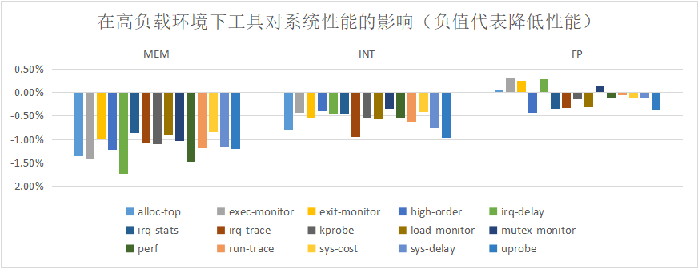

**nbench**是一款专门用于处理器以及存储器性能测试的基准测试程序，即著名的***BYTE Magazine***杂志的**BYTEmark benchmark program**，nbench在系统中运行并将结果和一台运行Linux的AMD K6-233电脑比较，得到的比值作为性能指数。由于是完全开源的，爱好者可以在各种平台和操作系统上运行Nbench，并进行优化和测试，是一个简单有效的性能测试工具。Nbench的结果主要分为**MEM**、**INT**和**FP**，其中MEM指数主要体现**处理器总线、CACHE和存储器性能**，INT**整数处理性能**，FP则体现**双精度浮点性能**（大多数嵌入式处理器都没有强大的双精度浮点能力）。

**stress-ng** 是一个常用的加压工具，支持多种产生系统负载的方式，包含 CPU 的浮点运算、整数运算、位元运算与控制流程等，可以用来测试系统在高负载的状况下的稳定性。stress-ng 必须小心使用，某些测试可能会造成设计不良的硬件过热，另外也可能让系统过载而难以停止负载测试。

这里我们使用上述两个工具进行测试，测试的硬件环境为

```shell
OS: Ubuntu 22.10 kinetic
Kernel: x86_64 Linux 5.19.0-43-generic
Uptime: 1d 19h 39m
Packages: 721
Shell: bash 5.2.2
Disk: 23G / 50G (47%)
CPU: Intel Core i7-7700HQ @ 4x 2.808GHz
GPU: VMware SVGA II Adapter
RAM: 2250MiB / 7914MiB
```


首先利用**nbench**测试系统在无压环境下的性能指数记为$P_0$，系统在 `stress-ng --cpu 8 --io 4 --vm 2 --vm-bytes 128M --fork 4` 压力时测得的性能指数记为$P_1$，测量5次，取指数的平均值$\overline{P_1}、\overline{P_0}$，由此得出工具各模块对性能的影响$D_1=(\overline{P_1}-\overline{P_0})/\overline{P_0}$。如下图所示，影响由百分百表示：


可见该压力对系统的三种指标都有较大（$-20\%$左右）的损耗。

有上述压力的同时运行工具各模块时nbench测得的性能指数记为$P_2$，测量5次，取指数的平均值$\overline{P_2}$，由此得出工具各模块在高负载环境下对性能的影响$D_2=(\overline{P_2}-\overline{P_1})/\overline{P_1}$算出。如下图所示：



在上述压力下，工具各模块对性能的**影响不超过$-2.00\%$** ，对FP的性能影响有好有坏且微乎其微，所以可认定其对FP无影响，因为工具没有涉及浮点运算且测试机由单独的**FPU**（浮点运算单元）。由此可以说明工具**对性能的影响较小**。

下一阶段计划在修复优化网络相关模块后加入网络负载进行测试。